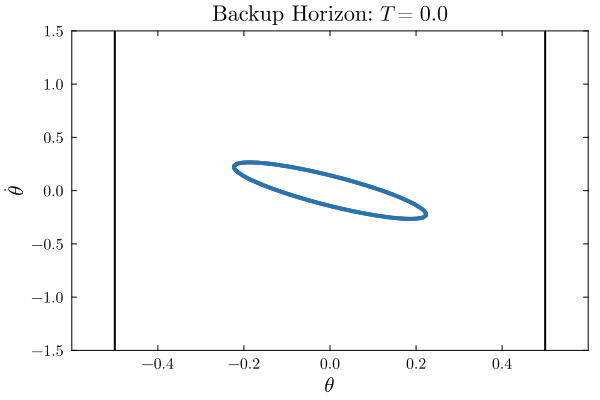

# BackupCBFs

The repository contains a Julia package that contains utilities needed to implement backup control barrier function (CBF) methods. Note that the code here is meant to be illustrative and not necessarily performant. See the Examples folder for simple examples that use this package.

## Installation
Clone this repo, activate the corresponding Julia environment, and then instantiate the environment to download all dependencies.